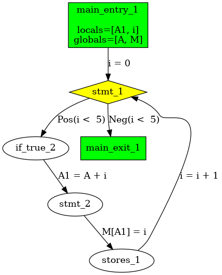

# Program Optimization

Implementation of the program optimization algorithms discussed in the lecture "Program Optimization" at the Technical University of Munich.

See the [Course Slides](https://www.cs.cit.tum.de/fileadmin/w00cfj/pl/ProgOpt/folien.pdf) for more information.

## Features

The project contains tools for arbitrary program optimization given in C-like code. The following optimizations are implemented:

- [x] Available Expressions Analysis
- [x] (True) Liveness Analysis
- [x] Superflous Assignments Analysis
- [x] Constant Propagation
- [x] Interval Analysis
- [x] Memory Aliasing Analysis (Basic)
- [x] Very Busy Expressions Analysis
- [x] Loop Rotation
- [x] Function Inlining
- [x] Transformation to Static Single Assignment (SSA)
- [x] Register Allocation (Graph Coloring)
  
## Example

The following code contains unnecessary bounds checks. The interval analysis can be used to remove them.

```c
int M[];
int A;

void main(int A0) {
  int i = 0;
  while (i < 5) {
    if (0 <= i) {
      if (i < 5) {
        int A1 = A + i;
        M[A1] = i;
        i = i + 1;
      }
    }
  }
}
```

### Initial CFG


### Resulting CFG



This corresponds to the following code:

```c
int M[];
int A;

void main(int A0) {
  int i = 0;
  while (i < 5) {
    int A1 = A + i;
    M[A1] = i;
    i = i + 1;
  }
}
```
